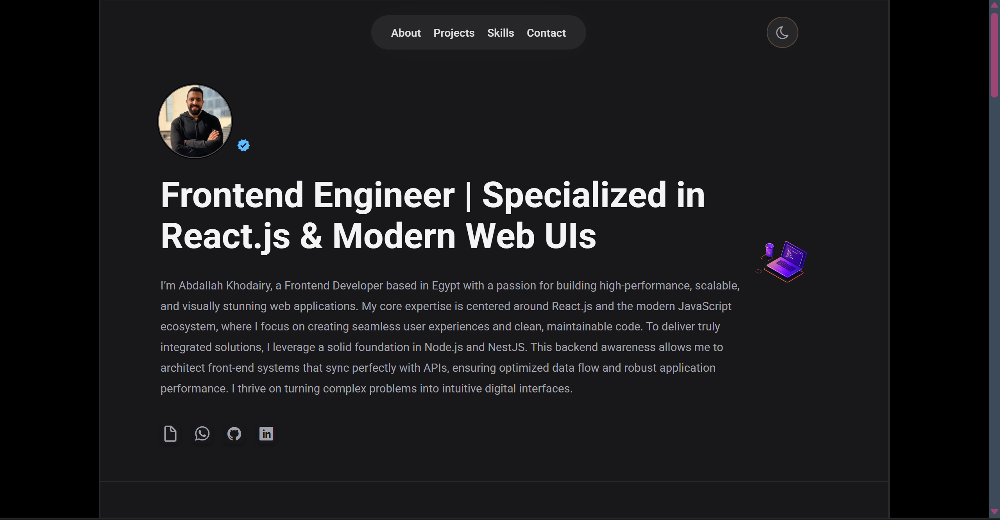

# 🚀 Personal Portfolio - React & Vite

A modern, responsive personal portfolio website built with **React.js** and **Vite**. This project showcases my professional journey, technical skills, and completed projects with a seamless user experience.

---

## 📸 Preview

[](https://abdallakhodairy-portfolio.netlify.app/)

---

## 🌐 Live Demo

🔗 [Visit My Portfolio](https://abdallakhodairy-portfolio.netlify.app/)

---

## 📖 Project Description

This portfolio serves as my digital business card. It is designed to provide recruiters with a clear overview of my capabilities. Key sections include:
- **Hero Section**: A brief introduction and professional summary with links for my CV & others.
- **Projects**: A curated gallery of my best work with live links.
- **Skills**: A visual representation of my technical proficiency in various technologies.
- **Contact Me**: Multiple ways to reach out, including social links and a professional CV download.

---

## ✨ Key Features

- **Dark & Light Mode**: A fully functional theme switcher for better accessibility and user preference.
- **High Performance**: Optimized using **Vite** for lightning-fast load times.
- **Modular Components**: Organized code structure using React's component-based architecture.
- **Smooth Animations**: Integrated animations to enhance the visual storytelling.
- **Responsive Design**: Fully optimized for mobile, tablet, and desktop screens.

---

## 🎯 Project Goals

The main objective of this project was to:
- Master **React.js** state management for theme switching.
- Utilize **Vite** for a modern and fast development workflow.
- Implement **Advanced CSS** techniques for responsive layouts and animations.
- Create a professional platform to showcase my growth as a Front-End Developer.

---

## 🛠 Tech Stack

- **Framework**: React.js
- **Build Tool**: Vite
- **Styling**: CSS3 (Modern Flexbox/Grid)
- **Language**: JavaScript (ES6+)

---

## 🚀 Installation & Run Locally

Follow these steps to run the project locally on your machine:

1. Clone the repository from GitHub:

```bash
git clone [https://github.com/Khodairy/MyPortfolio.git](https://github.com/Khodairy/MyPortfolio.git)
```

2. **Navigate to the project directory:**

```bash
cd MyPortfolio
```

3. **Install dependencies:**

```bash
npm install
```

4. **Start the development server:**

```bash
npm run dev
```

---

## 📁 Project Structure

```text
MyPortfolio/
├── public/              # Static assets (images, icons, and PDF CV)
│   ├── fonts/           # Custom typography
│   └── images/          # Portfolio screenshots and personal photos
├── src/                 # Source code
│   ├── animation/       # Animation logic and configurations
│   ├── assets/          # Static icons and UI assets
│   ├── components/      # Organized by section (Header, Hero, Main, Skills, etc.)
│   ├── App.jsx          # Main application component
│   ├── index.css        # Global styles and theme variables
│   └── main.jsx         # Entry point
├── vite.config.js       # Vite configuration
├── package.json         # Dependencies and scripts
└── README.md            # Project documentation
```

---

## 👤 Author

**Abdallah Khodairy**

- Front-End Developer
- GitHub: [@Khodairy](https://github.com/Khodairy)
- LinkedIn: [LinkedIn](https://www.linkedin.com/in/abdallah-khodairy/)
- Portfolio: [Portfolio](https://abdallakhodairy-portfolio.netlify.app/)
